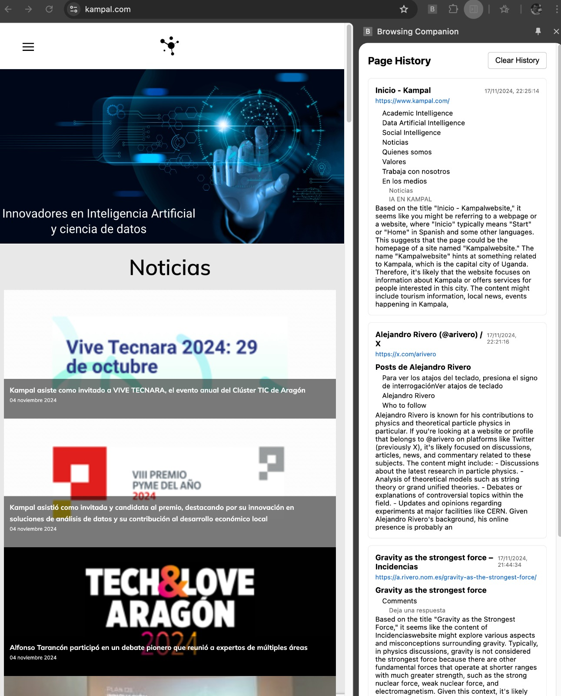

# Sidepanel Helpers
This repo contains a series of demos to use Chrome extension as a gateway
to build AI helpers over live websites, to test features without interfering
with the development cycle of the main production line.

They can also be used as generic copilots or web-companions.

Currently we only present here the **Sidepanel** module.



The project is in the backburner because we guess our clients, vertically, will
prefer an [iframe based solution](https://github.com/arivero/webIA), at the cost of forcing CORS compatibility of course.
On the other hand, depending of the traction from Deepmind's Project Mariner,
it could be worthwhile to restart from here. Not sure. At the moment, I will
just track [other github projects that refer to Mariner](./awesome.md). Feel
free to add yours.

## Features of sidepanel

- **Browsing History Tracking**: Keeps a record of visited pages with timestamps.
- **Heading Extraction**: Captures `<h1>`, `<h2>`, and `<h3>` headings from each page.
- **Persistent Storage**: Saves history using `chrome.storage.local` for persistence across sessions.
- **Real-time Updates**: Automatically updates when navigating to new pages or changing tabs.
- **Clear History**: Option to clear the browsing history from the side panel.
- **Minimal Permissions**: Uses `activeTab` permission to enhance user privacy.

### Files and Structure

- **`manifest.json`**: Defines extension permissions and includes side panel configuration.
- **`background.js`**: Handles extension activation and opens the side panel.
- **`sidepanel.html`**: The HTML template for the side panel UI.
- **`sidepanel.js`**: Contains the logic for managing history and injecting scripts.
- **`styles.css`**: CSS styles for the side panel UI.
- **`page-analyzer.js`**: Used for content script injection but programmatically
- **`options.html`**: The HTML template for the extension options UI.

### How It Works

1. **Extension Activation**: When the extension icon is clicked, `background.js` triggers and opens the side panel using `chrome.sidePanel.open()`.

2. **Side Panel Initialization**: `sidepanel.js` initializes the `SidepanelManager`, which:
   - Loads existing history from `chrome.storage.local`.
   - Sets up event listeners for tab updates and activations.
   - Injects a script into the current tab to collect page data.

3. **Data Collection**:
   - Uses `chrome.scripting.executeScript` with `activeTab` permission to inject a function that collects the page title, URL, and headings.
   - The injected function returns this data to `sidepanel.js`.

4. **History Management**:
   - The `BrowsingHistory` class manages the history entries, ensuring there are no duplicates and the size doesn't exceed the maximum limit.
   - Entries include the page title, URL, timestamp, and extracted headings.

5. **UI Update**:
   - The side panel UI displays the history entries with expandable headings.
   - Provides a "Clear History" button to reset the stored history.

## Installation and Setup

1. **Clone the Repository**

   ```bash
   git clone https://github.com/yourusername/your-repo.git
   ```

2.  Open Chrome and navigate to chrome://extensions/.

3. Enable Developer mode by toggling the switch in the top right corner.

4. Click on Load unpacked and select the sidepanel directory.

### Configuration

To enable AI features, you must configure the extension options:

1. **Open the Extension Options**: Right-click the extension icon and select "Options".
2. **Fill in the API Keys and Endpoints**:
   - **OpenAI API Key**: Your OpenAI API key.
   - **Ollama API Key**: Your Ollama API key.
   - **OpenAI Endpoint**: The endpoint for OpenAI API requests.
   - **Ollama Endpoint**: The endpoint for Ollama API requests.
   - **Default Client**: Select the default client (OpenAI or Ollama) to use for AI requests.

3. **Save the Options**: Click the "Save" button to store the configuration.

Once the options are configured, the AI features will be enabled and can be used within the side panel.
